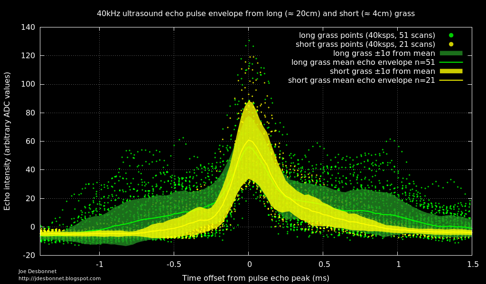
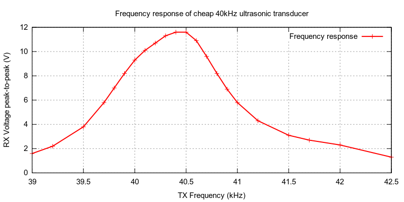
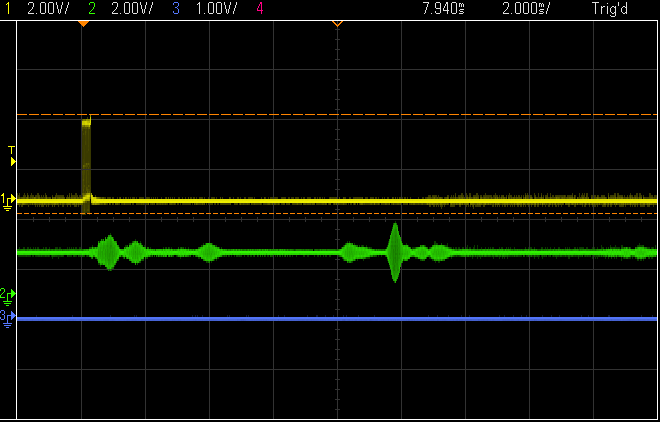

# LPC824_Ultrasonic_Ranger

This is a sonar sensor comprising a LPC824 ARM Cortex M0+ MCU, low cost 40kHz ultrasonic transducers and opamps. The firmware
uses the LPC824 ADC DMA (direct memory access) capability to read analog samples at high speed into SRAM.

Unlike many ranging sensors that output just distance to target, this project is 
designed to capture the entire echo of an ultrasonic 'ping'. Potential uses include
measuring agricultural crop yield. 

## Frequency response of low cost 40kHz transducer

Method: a transmitter and transducer are taped together (separation distance 0).
An oscilloscope (Keysight DSO-X 3014A) waveform generator is set to 5V peak-to-peak 
sine wave, and the receiver is connected to a channel on oscilloscope set to 2V 
per division.  The frequency is varied around 40kHz using waveform generator menu. 
Only one device pair was tested. 

Observation: useful bandwidth is only 1kHz centered at about 40.5kHz. 

Pulse (yellow) and echo (green) on oscilloscope:

## LPC824 pin utilization

|Pin| Function|                      |Pin | Function |           |
|---| --------| ---------------------|--- |----------|-----------|
| 1 | ADC3    | RX amp out           | 20 | PIO_0_14 | Debug pin |
| 2 | ADC9    | 2nd stage RX amp out | 19 | PIO0_0   | UART RXD  |
| 3 | PIO0_13 | nc                   | 18 | VrefP    | tied to 3.3V  |
| 4 | PIO0_12 | nc                   | 17 | VrefN    | tied to GND   |
| 5 | RESET   | SWD reset            | 16 | Vss      |           |
| 6 | PIO0_4  | UART                 | 15 | Vdd      |           |
| 7 | SWCLK   | SWD clock            | 14 |          |           |
| 8 | SWDIO   | SWD data             | 13 | PIO0_9   | Transducer TX_B |
| 9 | PIO0_11 | nc                   | 12 | PIO0_1   | nc              |
|10 | PIO0_10 | nc                   | 11 | PIO0_15  | Transducer TX_A |

